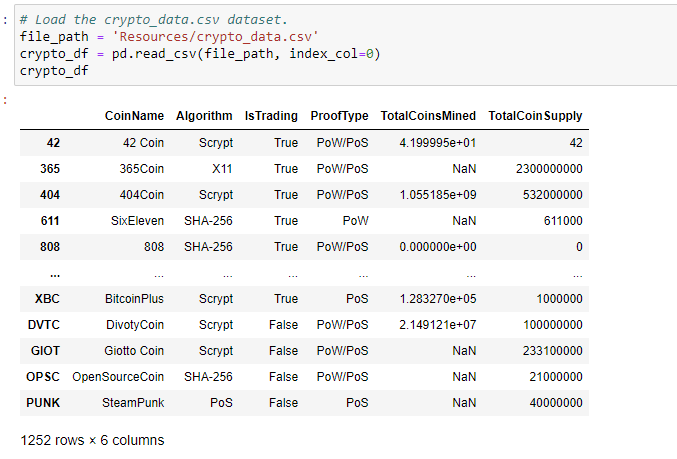
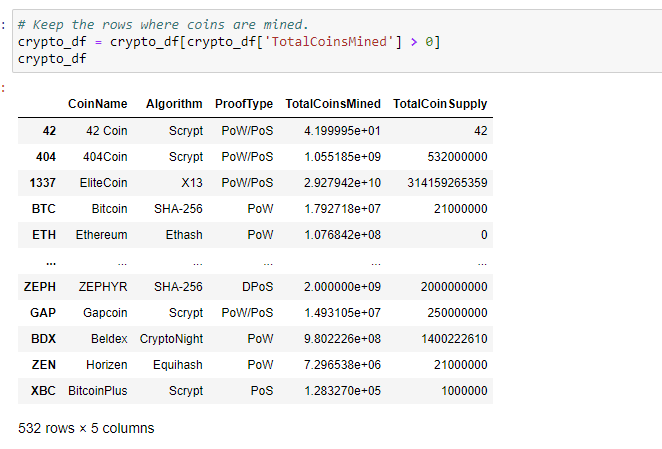

# Cryptocurrencies

## Overview of Project

Accountability Accounting, a prominent investment bank, is interested in offering a new cryptocurrency investment portfolio for its customers. The company, however, is lost in the vast universe of cryptocurrencies. So, they've asked for a a report that includes what cryptocurrencies are on the trading market and how they could be grouped to create a classification system for this new investment.

## Results

The data was processed to fit the machine learning models. Since there was no known output for what we were looking for, it was decided to use Unsupervised Learning. To group the currencies, a clustering algorithm was used. Data visualizations were also created to share the findings with the client.

This shows there are 1,252 cryptocurrencies currently trading.

This shows 532 cryptocurrencies are currently unlocked (totalcoinsmind).

Data classified into 4 groups and from results BitTorrent is the clear outlier while the other 3 clusters have relatively clear boundaries

